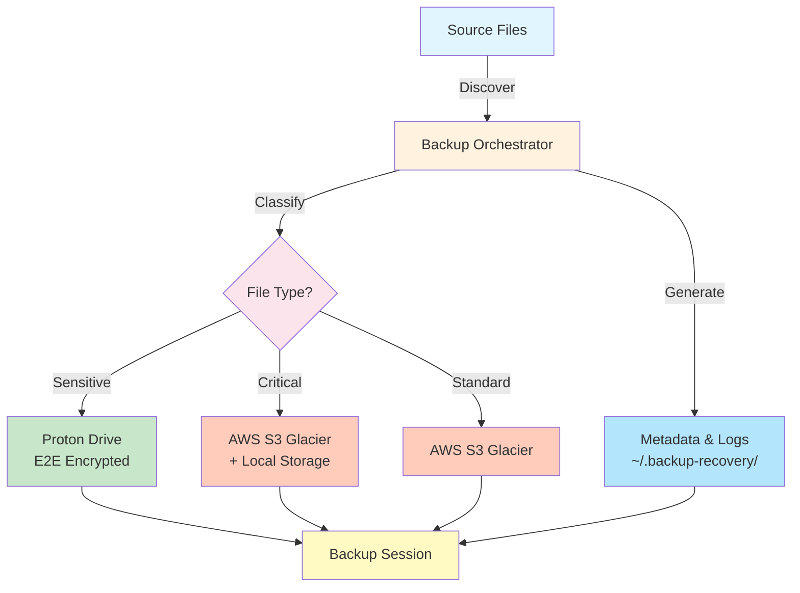

# Architecture Overview

Simple backup system that routes files to multiple storage locations for redundancy.

## Basic Design

Uses a simplified 3-2-1 strategy:
- **3 copies** of important data (original + 2 backups)
- **2 different storage types** (cloud + local)
- **1 offsite backup** (AWS S3)

## Components

### Backup Orchestrator
- Main coordination script (`backup_orchestrator.py`)
- Discovers files based on configured paths
- Classifies files using keywords and patterns
- Routes files to appropriate storage backends

### Storage Backends

#### AWS S3 (Primary)
- Direct to Glacier Flexible for cost savings (~$0.0036/GB/month)
- Most files go here by default
- Built-in durability and availability

#### Proton Drive (Sensitive)
- Files containing sensitive keywords or extensions
- End-to-end encrypted
- Limited to important sensitive files only

#### Local Storage (Critical)
- Important files also backed up locally
- External drive or local directory
- Offline protection from internet threats

## Data Flow

## File Classification

Files are automatically routed based on:
- **Sensitive keywords** in path/filename → Proton Drive
- **Sensitive extensions** (.key, .pem, .p12) → Proton Drive  
- **Critical patterns** → AWS + Local (dual backup)
- **Everything else** → AWS only

## Implementation Status

- ✅ Basic file discovery and classification
- ✅ Configuration loading and validation
- ✅ Logging and summary generation
- 🚧 AWS S3 operations (placeholder)
- 🚧 Proton Drive sync (placeholder)
- 🚧 Local backup operations (placeholder)
- ❌ Restore functionality (not yet implemented)